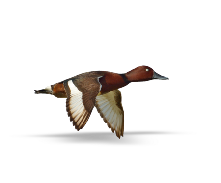

<!-- PROJECT SHIELDS -->
[![Codacy Badge][codacy-shield]][codacy-url]
[![Issues][issues-shield]][issues-url]
[![Forks][forks-shield]][forks-url]
[![Stargazers][stars-shield]][stars-url]
[![repo-size][repo-size-shield]][repo-size-url]
[![Contributors][contributors-shield]][contributors-url]
[![license][license-shield]][license-url]
[![ci][ci-shield]][ci-url]
[![OpenSSF Best Practices][floss-shield]][floss-url]

<!-- PROJECT LOGO -->
<br />
<div align="center">

  <h3 align="center">creature-shoveler</h3>

   <a href="#">
      
   </a>

  <p align="center">
    Some thing
    <br />
    <a href="#"><strong>See live (soon) »</strong></a>
    <br />
    <br />
    <a href="https://github.com/apply-creatures/creature-shoveler/issues">Report Bug</a>
    ::
    <a href="https://github.com/apply-creatures/creature-shoveler/issues">Request Feature</a>
  </p>
</div>

<p align="center">
OK, DOkey
</p>

<!-- TABLE OF CONTENTS -->
<details>
  <summary>Table of Contents</summary>
      <ol>
         <li>
            <a href="#about">About</a>
            <ul>
                <li>
                    <a href="#built-with">Built With</a>
                </li>
            </ul>
         </li>
         <li>
         <a href="#getting-started">Getting Started</a>
         <ul>
            <li><a href="#prerequisites">Prerequisites</a></li>
            <li><a href="#repo">Repo</a></li>
            <li><a href="#develop">Develop</a></li>
            <li><a href="#build">Build</a></li>
            <li><a href="#deploy">Deploy</a></li>
         </ul>
         </li>
         <li><a href="#roadmap">Roadmap</a></li>
         <li><a href="#contributing">Contributing</a></li>
         <li><a href="#license">License</a></li>
         <li><a href="#acknowledgments">Acknowledgments</a></li>
      </ol>
</details>

<hr/>

**TL;DR** - skip to [getting-started](#getting-started)


<hr/>

<!-- ABOUT THE PROJECT -->

## About

Yet another flying shoveler

`creature-shoveler` is a project automation tool designed to streamline the initialising projects. It empowers developers by automating the setup of project structures, reducing (some of the) manual configuration time, and ensuring consistent README.md layouts.


## Why `creature-shoveler`?

Copier is written in Python. Yeoman and other nodejs generators are either dead projects or too overkill, or/and inflexible.

## Contributing

Contributions to `creature-shoveler` are welcome! Fork the repository, create your feature branch, commit your changes, and submit a pull request. Please refer to the [Contributing Guidelines](CONTRIBUTING.md) for more details.

## License

This project is licensed under the [MIT License](LICENSE). See the LICENSE file for more details.


## Features

- **Template-based Project Creation:** Quickly generate project structures tailored to Node.js, Go, Rust, and Python, including Dockerfile configurations and README templates.
  
- **Customizable Templates:** Utilize customizable templates for various project aspects such as README files, Dockerfile, package descriptors, configurations, and more.

- **Prompt-based Configuration:** User-friendly prompts guide users through project setup, allowing customization of project names, descriptions, licenses, and other boring yet important matters.


Of course, nothing is perfect, but I will try to keep this up to date and fix issues right here.
If you've truly tried everything and still can't get this to work for you, try to reach out. Or raise an issue. But I make no promise

<p align="right">(<a href="#readme-top">back to top</a>)</p>

### Built With

- [node.js](https://nodejs.org/) - of course
- typescript

### Also using

- winston
- enquirer

<hr/>

<!-- GETTING STARTED -->

## Getting Started

### Prerequisites

- you need [Git](https://git-scm.com/) installed
- and [nodejs](https://nodejs.org/) of course

### Set up repo

```bash
$ git clone https://github.com/apply-creatures/creature-shoveler.git
```

Navigate to the repo root's folder & install dependencies

```bash
$ cd ./creature-shoveler && npm install
```

### Develop

```bash
$ npm run start
```

**Access via browser**

- Hit [http://localhost:3000](http://localhost:3000)

**run tests**

```bash
$ npm run test
```
### Build

This command will compile for production deployment:

```bash
$ npm run build
```

### Deploy

```bash
$ npm run deploy
```
<p align="right">(<a href="#readme-top">back to top</a>)</p>

<hr/>

## Roadmap

- [x] Setup a repo with nodejs
- [x] Write the core logic
- [x] Templates for nodejs
- [x] Some Test
- [ ] Templates for Python
- [ ] Templates for other common tech

<hr/>

## Contributing

Contributions are what make the open source community such an amazing place to learn, inspire, and create. Any contributions you make are **greatly appreciated**.

If you have a suggestion that would make this better, please fork the repo and create a pull request. You can also simply open an issue with the tag "enhancement".
Don't forget to give the project a star! Thanks again!

1. Fork the Project
2. Create your Feature Branch (`git checkout -b feature/some-feature`)
3. Commit your Changes (`git commit -m 'Add some feature'`)
4. Push to the Branch (`git push origin feature/some-feature`)
5. Open a Pull Request

For more on how to contribute and the code of conduct, see [CONTRIBUTING.md](./CONTRIBUTING.md).

### Security

To report vulnerabilities, see [SECURITY.md](SECURITY.md).

<hr/>

<p align="right">(<a href="#readme-top">back to top</a>)</p>

<hr/>

## Acknowledgments

It would never end. I've done this work not just off dozens of other people's open source work, but hundreds, thousands, or maybe millions.

<!-- Refs -->

[codacy-url]: https://app.codacy.com/gh/Apply-Creatures/creature-shoveler/dashboard
[codacy-shield]: https://img.shields.io/codacy/grade/d51d2c336a1d431dac468829d5e3bdc6?style=for-the-badge
[contributors-shield]: https://img.shields.io/github/contributors/apply-creatures/creature-shoveler.svg?style=for-the-badge
[contributors-url]: https://github.com/apply-creatures/creature-shoveler/graphs/contributors
[forks-shield]: https://img.shields.io/github/forks/apply-creatures/creature-shoveler.svg?style=for-the-badge
[forks-url]: https://github.com/apply-creatures/creature-shoveler/network/members
[stars-shield]: https://img.shields.io/github/stars/apply-creatures/creature-shoveler.svg?style=for-the-badge
[stars-url]: https://github.com/apply-creatures/creature-shoveler/stargazers
[issues-shield]: https://img.shields.io/github/issues/apply-creatures/creature-shoveler.svg?style=for-the-badge
[issues-url]: https://github.com/apply-creatures/creature-shoveler/issues
[license-shield]: https://img.shields.io/github/license/apply-creatures/creature-shoveler.svg?style=for-the-badge
[license-url]: https://github.com/apply-creatures/creature-shoveler/blob/main/LICENSE.txt
[score-shield]: https://img.shields.io/ossf-scorecard/github.com/apply-creatures/creature-shoveler?style=for-the-badge
[score-url]: https://github.com/apply-creatures/creature-shoveler
[repo-size-shield]: https://img.shields.io/github/repo-size/apply-creatures/creature-shoveler?style=for-the-badge
[repo-size-url]: https://github.com/apply-creatures/creature-shoveler/archive/refs/heads/main.zip
[product-screenshot]: images/apply-creatures-logo.png
[ci-shield]: https://ci.applycreatures.com/api/badges/2/status.svg
[ci-url]: https://ci.applycreatures.com/repos/2
[floss-shield]: https://www.bestpractices.dev/projects/9198/badge?style=for-the-badge
[floss-url]: https://www.bestpractices.dev/projects/9198

## Changelog

Changelog see [here](CHANGELOG.md)

## License

[![license][license-shield]][license-url]

If you too produce work and publish it out there, it's clearer to choose a [license](https://choosealicense.com).
